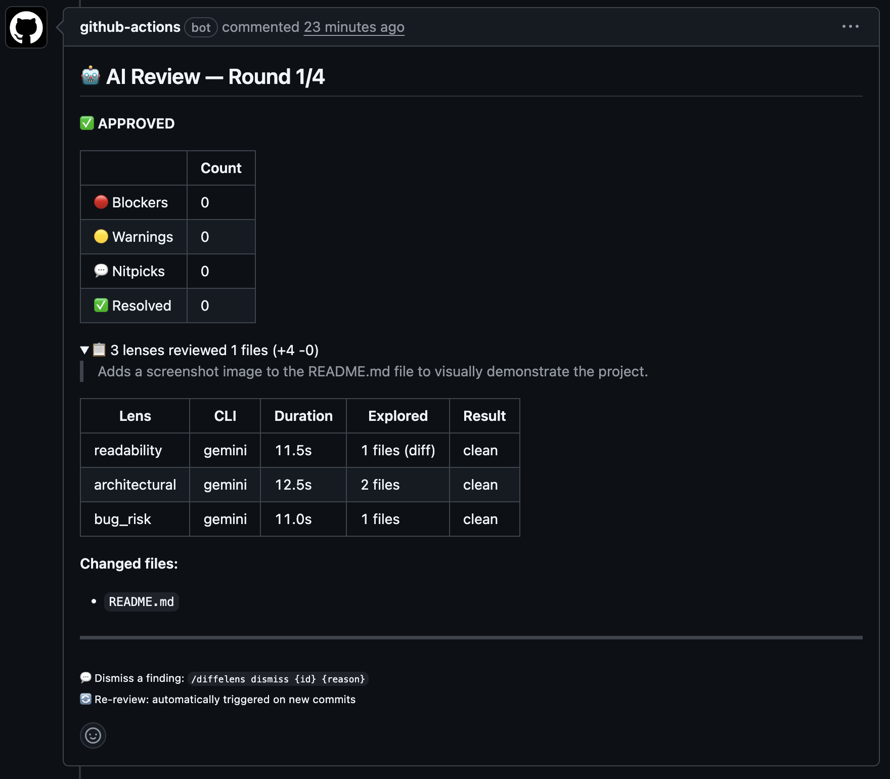

<p align="center">
  
</p>

<p align="center">

[](https://github.com/Mizune/diffelens/actions/workflows/ci.yml)
[](https://www.npmjs.com/package/diffelens)
[](https://opensource.org/licenses/MIT)

</p>

AI PR review orchestrator with customizable review lenses. Add project-specific review perspectives — security, performance, i18n, or anything else — by writing a prompt file and a few lines of YAML.

Ships with three built-in lenses (readability / architectural / bug_risk) and supports Claude Code, Codex CLI, and Gemini CLI as execution engines.

<p align="center">
  
</p>

## Concept

- **Multi-Lens Review** — Built-in lenses review from three perspectives in parallel: readability, architecture, and bug risk
- **Custom Lenses** — Add project-specific review perspectives with a prompt file and config entry. Security, performance, i18n, accessibility — any review focus you can describe
- **Adaptive Context** — Control what each lens sees: diff-only isolation or full repository exploration with tools
- **Multi-CLI Support** — Mix and match Claude Code, Codex, and Gemini per lens
- **Convergent Review** — Round-based severity filtering narrows focus until only blockers remain, then auto-approves

## Quick Start

### Local Review

```bash
# Install diffelens and at least one LLM CLI
npm install -g diffelens
npm install -g @anthropic-ai/claude-code  # or @google/gemini-cli or @openai/codex

# Set your API key
export ANTHROPIC_API_KEY=sk-ant-xxx

# Review current branch changes
diffelens --diff-target branch
```

### GitHub Actions

Add the workflow to your repo — diffelens posts a review comment on every PR:

```yaml
# .github/workflows/ai-review.yml
name: AI PR Review
on:
  pull_request:
    types: [opened, synchronize]

permissions:
  pull-requests: write
  contents: read

jobs:
  ai-review:
    runs-on: ubuntu-latest
    timeout-minutes: 15
    steps:
      - uses: actions/checkout@v4
        with:
          fetch-depth: 0
      - uses: actions/setup-node@v4
        with:
          node-version: "20"
      - run: npm install -g diffelens @anthropic-ai/claude-code
      - run: diffelens
        env:
          GITHUB_TOKEN: ${{ secrets.GITHUB_TOKEN }}
          GITHUB_REPOSITORY: ${{ github.repository }}
          ANTHROPIC_API_KEY: ${{ secrets.ANTHROPIC_API_KEY }}
          PR_NUMBER: ${{ github.event.pull_request.number }}
          BASE_SHA: ${{ github.event.pull_request.base.sha }}
          HEAD_SHA: ${{ github.event.pull_request.head.sha }}
```

### Configuration

Place `.diffelens.yaml` at the repository root to customize lenses, models, and convergence settings.
If no config exists, diffelens uses its bundled default (Claude Code).

```yaml
# .diffelens.yaml
version: "1.0"
global:
  max_rounds: 4
  default_cli: "claude"
lenses:
  readability:
    cli: "claude"
    model: "claude-sonnet-4-6"
    isolation: "tempdir"
    tool_policy: "none"
    severity_cap: "warning"
  architectural:
    cli: "claude"
    model: "claude-opus-4-6"
    isolation: "repo"
    tool_policy:
      type: "explicit"
      tools: ["Read", "Grep", "Glob"]
  bug_risk:
    cli: "claude"
    model: "claude-opus-4-6"
    isolation: "repo"
    tool_policy:
      type: "explicit"
      tools: ["Read", "Grep", "Glob"]
```

## Custom Lenses

Any lens name beyond the three built-ins (`readability`, `architectural`, `bug_risk`) is a custom lens. Define it in `.diffelens.yaml` and point it at a prompt file.

### Adding a custom lens

**1. Write a prompt file** (e.g. `prompts/security.md`):

```markdown
# Security Review Lens

You are a security specialist. Review the diff for:

- Injection vulnerabilities (SQL, command, XSS)
- Hardcoded secrets or credentials
- Insecure deserialization
- Missing input validation at trust boundaries
- Authentication / authorization gaps

## Out of Scope
- Code style and readability (handled by other lenses)
- Performance optimization

## Severity Criteria
- blocker: Exploitable vulnerability or leaked secret
- warning: Missing validation that could become exploitable
- nitpick: Minor hygiene improvements
```

**2. Add the lens to config:**

```yaml
# .diffelens.yaml
lenses:
  security:
    enabled: true
    prompt_file: "prompts/security.md"   # required for custom lenses
    cli: "claude"
    model: "claude-opus-4-6"
    isolation: "repo"                     # allow repository exploration
    tool_policy: "all"
    severity_cap: "blocker"
```

That's it — diffelens will now run four lenses in parallel on every review.

### Extending a built-in prompt

For built-in lenses, you can append project-specific rules without replacing the entire prompt:

```yaml
lenses:
  readability:
    prompt_append_file: "review-rules/readability-extra.md"
```

The content of `readability-extra.md` is appended to the built-in readability prompt.

### Use case ideas

| Lens | Focus |
|------|-------|
| `security` | OWASP Top 10, secrets, input validation |
| `performance` | N+1 queries, unnecessary re-renders, large bundle imports |
| `i18n` | Hardcoded strings, locale-sensitive formatting, RTL issues |
| `accessibility` | ARIA attributes, keyboard navigation, color contrast |
| `test_coverage` | Missing test cases, boundary conditions, error paths |
| `migration_safety` | Backward compatibility, rollback strategy, data loss risk |

See [Local Mode Guide — Custom Prompts](docs/local-mode.md#custom-prompts) for full details.

## Documentation

| Guide | Description |
|-------|-------------|
| [Local Mode](docs/local-mode.md) | CLI options, diff targets, custom prompts, convergence settings |
| [GitHub Actions](docs/github-actions.md) | Workflow setup, secrets, state management, troubleshooting |

## Contributing

```bash
git clone https://github.com/Mizune/diffelens.git
cd diffelens
npm install
npm test

# Run from source
npx tsx src/main.ts --diff-target branch
```
